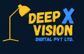

# ⚡ DeepX Vision Downloader (Pro Edition)

A high-performance Windows desktop application for downloading high-quality media (8K, 4K, 1080p, MP3, and Carousels) from YouTube, YouTube Shorts, TikTok, Instagram, Facebook, X (Twitter), Vimeo, and 1,000+ websites.

---

## 🌟 Features

- **⚡ Multi-Platform Engine**: Supports YouTube, Shorts, TikTok, Instagram, Facebook, X (Twitter), Reddit, Vimeo, SoundCloud, and 1,000+ sites.
- **🎬 YouTube Shorts & Videos**: Dedicated extraction tabs with rich video thumbnail previews.
- **♪ TikTok Full Support**: Downloads latest videos, watermark-free audio, and multi-photo slide carousels.
- **🔄 Auto-Updater**: Checks for the latest features and upgrades silently in 1-click.
- **📋 Smart Clipboard Monitor**: Automatically detects copied media URLs for instant 1-click download.
- **🌐 Built-in Browser**: Download restricted or private content with auto-cookie session sync.
- **📁 Creator Folder Auto-Organization**: Automatically organizes downloads by creator handle or channel name.
- **🎨 Modern Dark UI**: Built with CustomTkinter, real-time download speeds, ETAs, pause/resume, and task context menus.

---

## 📥 Download & Installation

1. Go to the [Releases](https://github.com/junaidali123ik2018/DeepX-Vision-Downloader/releases) section.
2. Download the latest installer: **`DeepX_Vision_Downloader_Pro_Setup_v2.5.0.exe`**.
3. Double-click the setup file to install. The installer will create desktop and start menu shortcuts automatically.

---

## 💎 License & Activation

DeepX Vision Downloader includes a free daily trial (5 video downloads/day). 

To purchase a **Pro Edition License Key** (1 Month, 1 Year, or Lifetime Unlimited):
- ✉️ **Contact Email**: [Jaidijutt0012@gmail.com](mailto:Jaidijutt0012@gmail.com)
- Instant delivery with 1-to-1 PC activation support.

---

## ⚖️ Publisher & Credits

- **Publisher**: Junaid Ali
- **Product**: DeepX Vision Downloader Pro
- **Engine**: Powered by `yt-dlp` and `imageio-ffmpeg`.
